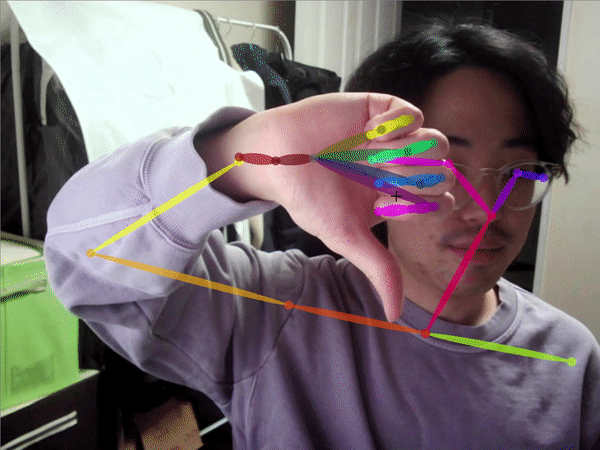
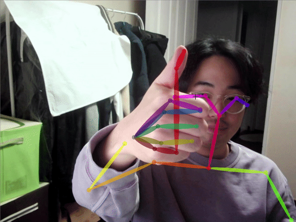
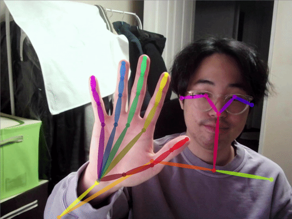
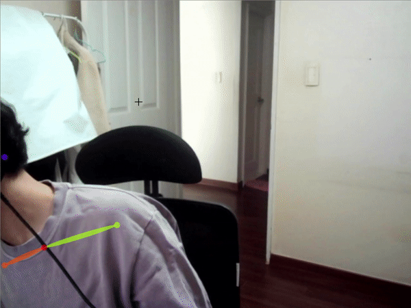
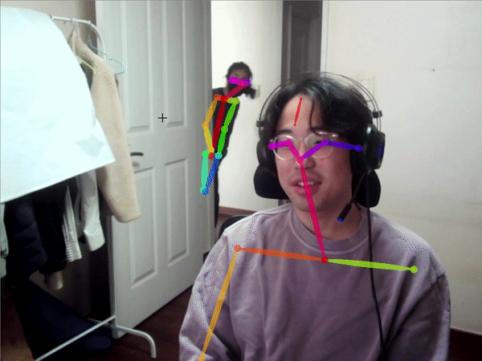
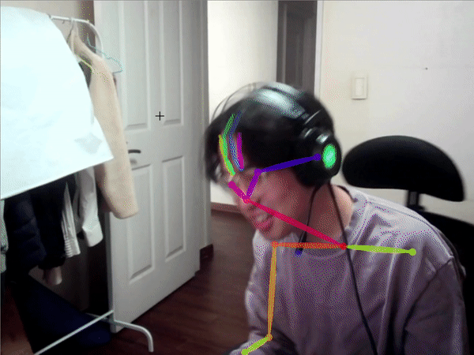

# Any Questions? 🖐🖐🖐🖐🖐
## Motion detector for interactive online real-time class
We deliver a body movement & hand gesture detector that can enhance the interactivity of online real-time classes.
## Demo
### Hand Gesture Recognition

Our application can recognize hand gestures such as thumbs down, thumbs up, and raise hands (from left to right), sending the corresponding alarm message to the Zoom chat.

### Body Detection

Our application can detect huge body movements and the number of people on the camera, sending the corresponding alarm message to the Zoom chat.

To see how our application works synchronously with detecting movements and sending messages, check the [link](https://www.youtube.com/watch?v=tICAKQrIidc) for our demo video.

## Quantitative Results

Confusion matrices of each model. The upper line shows the results of the MLP classifier and the lower line shows the results of the CNN-based classifier. The column names indicate predicted labels and the row names indicate the ground truth labels.

## Methods
### Flow of application

Process of our application. Motion detection and gesture recognition are independent of each other. Both tasks use OpenPose to get the keypoints. Motion detection is based on pre-defined metrics which are manually designed. Gesture recognition is done by a classifier. We implemented two different classifiers.

### Data preprocessing
We extracted hand keypoints from the Jester dataset images using OpenPose. Check CSV Maker.py and data2csv.py for more details.
To improve the training quality, we first preprocessed the dataset in two ways: normalizing and modifying the length of sequence.
#### 1. Normalizing
We normalized the x, y coordinates of the hand keypoints in each frame to force the model to learn only the gesture, not the location of hand on the image. Normalization process also allows the model to be applied regardless of the resolution of the video.
#### 2. Modifying the length of sequence
Since the two classifiers take only fixed-size inputs, we modified the length of sequence using three different metrics: *Mid*, *MaxConf*, and *Duplicate*.

+ *Mid* extracts a fixed number of frames in the 60% point of the full sequence. For example, if we are planning to use 12 from the 20 frames, we took the 6th~17th.

+ *MaxConf* uses the frame with maximum confidence and its neighbors. Frame with high confidence is likely to contain our target gesture because the gestures are static and done right in front of the camera, which makes OpenPose easily find the joints.

+ *Duplicate* matches the length by duplicating the frames. For example, when the original sequence is {1, 2, 3} and we want to make the length to 10, it becomes {1, 1, 1, 2, 2, 2, 2, 3, 3, 3}.

### MLP classifier
Considering the real-time setting and relatively small input size, we decided to use a small MLP classifier. It takes a sequence of hand keypoints with the confidence level for each joint and predicts the gesture. However, a simple MLP classifier cannot learn any temporal information, which is crucial for gesture recognition. Check the MLP model training code [here (GestureMLP.ipynb)](https://colab.research.google.com/drive/1amDIhHZz_WtkFU0zPwo986QEVdvbEX_S#scrollTo=YmFlCTA0u-4W&uniqifier=2).

### CNN-based classifier

We also trained a CNN-based classifier to overcome the disadvantages of the MLP classifier. We used the model architecture from the paper [Deep Learning for Hand Gesture Recognition on Skeletal Data](https://ieeexplore.ieee.org/document/8373818). In this work, they used multi-channel CNN to extract channel-specific features. The channel indicates each coordinate (x, y) of a joint. Each CNN consists of two feature extractors and one residual branch. They produces channel-specific features by concatenating the three outputs. Final MLP layer takes the extracted features as input and predicts the gesture. We modified some minor points of the existing model, such as input/output dimensions and activation function. Check the CNN-based model training code [here (GestureCNN.ipynb)](https://colab.research.google.com/drive/1EgJt0P3w28_fkQxq__0R_s_88VGasuGg#scrollTo=jTqC9q7HPVno).

### Zoom API

In order to use Zoom Web SDK APIs, we built an OAuth app in the zoom marketplace. Then, by its app credentials we generated a base64 encoded credential called authorization code. Next, we made a json file which requests an OAuth token to Zoom. Finally, we were able to send Channel messages by using the http protocol client module in python, with OAuth token as its authentication code. This connection between the Channel and the python file enabled us to send Channel messages whenever the model detects big movements or notices specific hand gestures.

## Required Installation
* Openpose (https://github.com/CMU-Perceptual-Computing-Lab/openpose)
* pytorch (>= 1.6.0 to use model trained on Colab default settings in local environment)
* npm (for Zoom SDK)
Caution about Zoom
* Zoom API (https://marketplace.zoom.us/docs/api-reference/zoom-api)
 (Build an Zoom OAuth App for authentication: https://marketplace.zoom.us/develop/create)

## Reference
* Z. Cao, G. Hidalgo, T. Simon, S. -E. Wei and Y. Sheikh, "OpenPose: Realtime Multi-Person 2D Pose Estimation Using Part Affinity Fields," in IEEE Transactions on Pattern Analysis and Machine Intelligence, vol. 43, no. 1, pp. 172-186, 1 Jan. 2021
* N. H. Dardas and N. D. Georganas, “Real-time hand gesture detection and recognition using bag-of-features and support vector machine techniques,” IEEE. Trans. Instrum. Meas., vol. 60, no. 11, pp. 3592–3607, Nov. 2011.
* N. H. Dardas and E. M. Petriu, “Hand gesture detection and recognition using principal component analysis,” in Proc. CIMSA, Ottawa, Canada, 2011, pp. 1–6.
* O. Kop¨ ukl ¨ u, A. Gunduz, N. Kose, and G. Rigoll. Real-time ¨ hand gesture detection and classification using convolutional neural networks. CoRR, abs/1901.10323, 2019.
* G. Devineau, F. Moutarde, W. Xi, and J. Yang. Deep learning for hand gesture recognition on skeletal data. In 2018 13th IEEE International Conference on Automatic Face Gesture Recognition (FG 2018), pages 106–113, May 2018. 2, 6
